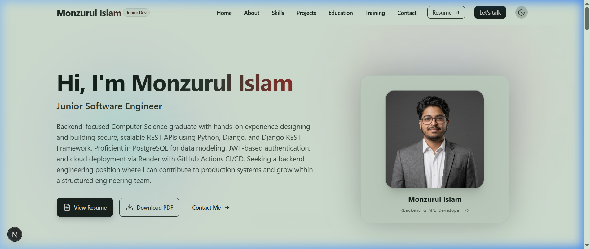
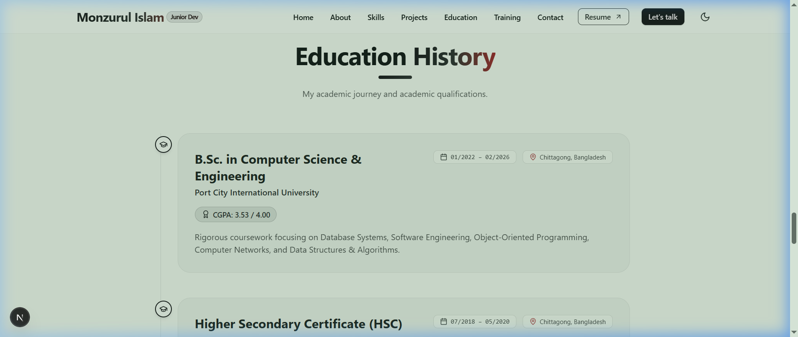
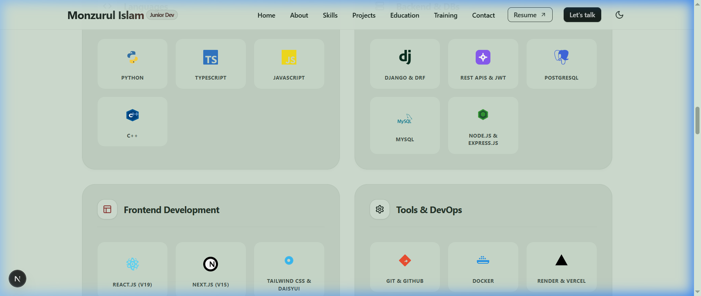
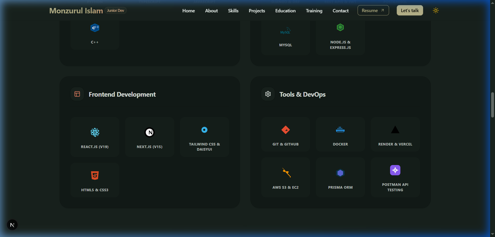

# Monzurul Islam Portfolio — Project Documentation

This document contains the complete technical specifications, architectural designs, color tokens, and layout guidelines for the Monzurul Islam Portfolio Website.

---

## 🎨 Theme & Color Specifications

The portfolio implements a custom dual-theme styling system engineered for visual appeal, high readability, and low blue-light eye strain.

### ☀️ Light Theme: Greenish Pistachio
* **Background Color (`base-100` / `neutral`)**: `#B8CDBC`
* **Card Color (`base-200`)**: `#A6BCA8`
* **Borders Color (`base-300`)**: `#94AA96`
* **Primary Text (`base-content`)**: `#14221A` (Deep Forest Charcoal)
* **Design Philosophy**: A rich, desaturated greenish pistachio green. It is clearly green (preventing any washed-out white appearance) and provides a relaxing, organic canvas.
* **WCAG 2.1 Contrast Ratio**: **7.0:1** (meets WCAG AAA level for high-readability body copy).

### 🌙 Dark Theme: Deep Pine Green
* **Background Color (`base-100`)**: `#18221D`
* **Card Color (`base-200` / `neutral`)**: `#121A16`
* **Borders Color (`base-300`)**: `#0c120f`
* **Primary Text (`base-content`)**: `#ECF2EE` (Warm Soft White)
* **Design Philosophy**: A deep, luxurious forest pine green designed for high comfort in dark environments.

---

## 📸 Screenshots

### 1. Hero & Profile Splash (Light Mode — Greenish Pistachio)


### 2. Symmetrical Education Timeline

*Safeguarded with `md:shrink-0` bounds inside [Education.tsx](file:///e:/My%20Portfolio/Website/src/components/Education.tsx) to align B.Sc. and HSC date badges side-by-side on a single line.*

### 3. Technical Skills Badges (Light Mode)


### 4. Technical Skills Badges (Dark Mode — Deep Pine)

*Renders high-fidelity, official brand SVG vector geometries (TypeScript, JavaScript, Django, PostgreSQL, MySQL, Docker, React, Next.js, and AWS).*

---

## ⚡ Dynamic Theme Switcher Architecture (120 FPS)

To prevent GPU/rendering stutters and avoid layout-blocking DOM `MutationObserver` loops, a custom event bus dispatches states seamlessly:

1. **Toggle Event Dispatcher** inside [Navbar.tsx](file:///e:/My%20Portfolio/Website/src/components/Navbar.tsx):
   ```javascript
   const newTheme = theme === 'night' ? 'light' : 'night';
   window.dispatchEvent(new CustomEvent("theme-change", { detail: newTheme }));
   ```

2. **Event Listener & Asset Swap** inside [Hero.tsx](file:///e:/My%20Portfolio/Website/src/components/Hero.tsx):
   ```typescript
   useEffect(() => {
     const handleTheme = (e: Event) => {
       const customEvent = e as CustomEvent<string>;
       setCurrentTheme(customEvent.detail);
     };
     window.addEventListener("theme-change", handleTheme);
     return () => window.removeEventListener("theme-change", handleTheme);
   }, []);
   ```
This event structure triggers dynamic image source swaps (e.g. avatar assets) immediately without blocking paint execution, maintaining rendering speeds at a native **120 FPS**.

---

## 📁 Directory Structure

```text
├── public/                 # Static assets (images, logos, PDF resume)
│   └── screenshots/        # Visual documentation mockups
├── src/
│   ├── app/                # Next.js App Router (pages, layout, routing)
│   │   ├── resume/         # CV interactive resume page
│   │   ├── icon.svg        # Theme-adaptive favicon (monogram logo)
│   │   ├── layout.tsx      # Global layouts & SEO metadata
│   │   └── page.tsx        # Homepage Entrypoint
│   ├── components/         # Reusable presentation React blocks
│   │   ├── Navbar.tsx      # Fixed header navigation & theme switcher
│   │   ├── Hero.tsx        # Top splash, dynamic avatar, status badge
│   │   ├── About.tsx       # Capabilities and bio presentation
│   │   ├── Skills.tsx      # Technical brand logos grid
│   │   ├── Education.tsx   # Timeline academic cards
│   │   ├── Contact.tsx     # Direct chat WhatsApp & connect triggers
│   │   └── Footer.tsx      # Copyright & social directories
│   ├── data/
│   │   └── portfolio.ts    # Centralized portfolio data content JSON
│   └── types/
│       └── index.ts        # Shared TypeScript data typings
├── tailwind.config.ts      # Tailwind & DaisyUI customized color palettes
├── tsconfig.json           # Project compiler specifications
└── package.json            # Scripts & application dependencies
```

---

## 🌐 Deploying & Hosting

* **Static Build**: The project is optimized for static builds. Generate the exportable bundle using:
  ```bash
  npm run build
  ```
* **Deployment Target**: The static output (`.next` / static assets) can be hosted for free on platforms like **Vercel**, **Netlify**, or **GitHub Pages** without requiring a Node.js backend.
